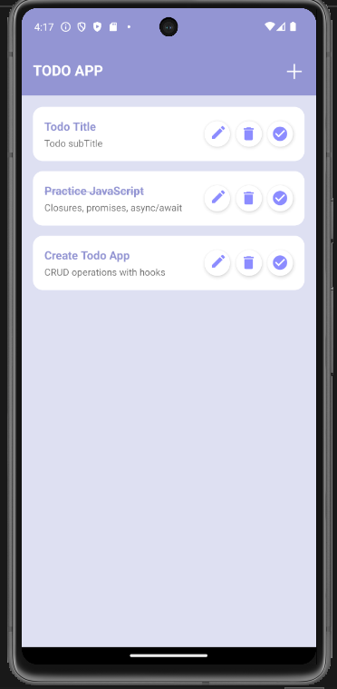
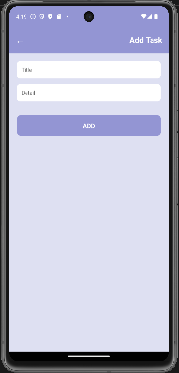
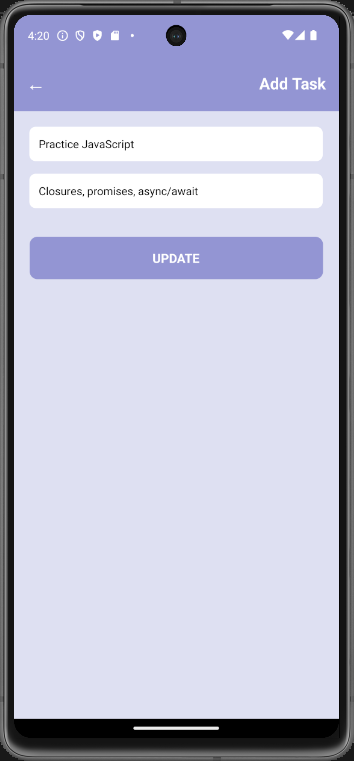

📋 React Native Todo App

A modern and user-friendly Todo Application built with React Native, featuring full CRUD operations, clean UI, and smooth task management experience.
This project demonstrates my expertise in mobile app development, React Hooks, and UI/UX implementation.

✨ Features..................................

➕ Add new tasks with title & details

✏️ Edit existing tasks

❌ Delete tasks

✅ Mark tasks as completed

📃 List tasks using FlatList

🎨 Clean & modern UI design

⚡ Fast performance with React Hooks

📱 Optimized for Android devices

🛠️ Tech Stack...........................

React Native

JavaScript (ES6+)

React Hooks (useState)

FlatList

Material Icons (react-native-vector-icons)

Android Emulator / Physical Device

📸 App Screenshots

  
  
  

🚀 How to Run the Project Locally..................
1️⃣ Clone the repository
git clone https://github.com/your-username/react-native-todo-app.git
cd react-native-todo-app

2️⃣ Install dependencies
npm install

3️⃣ Link vector icons (if required)
npx react-native link react-native-vector-icons

4️⃣ Start Metro bundler
npx react-native start

5️⃣ Run on Android
npx react-native run-android

📂 Project Structure
react-native-todo-app/
 ├── android/
 ├── ios/
 ├── App.js
 ├── package.json
 ├── screenshots/
 └── README.md

 This project highlights my ability to:

✅ Build real-world mobile apps

✅ Implement CRUD operations

✅ Design clean & responsive UI

✅ Write maintainable React Native code

✅ Deliver client-ready applications

